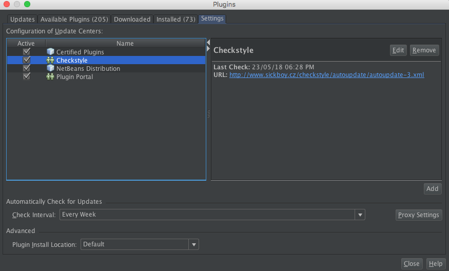
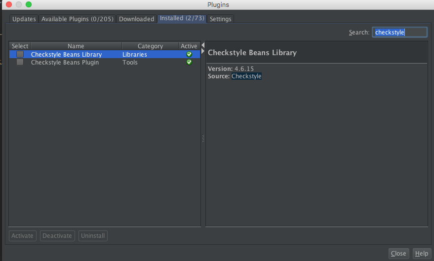
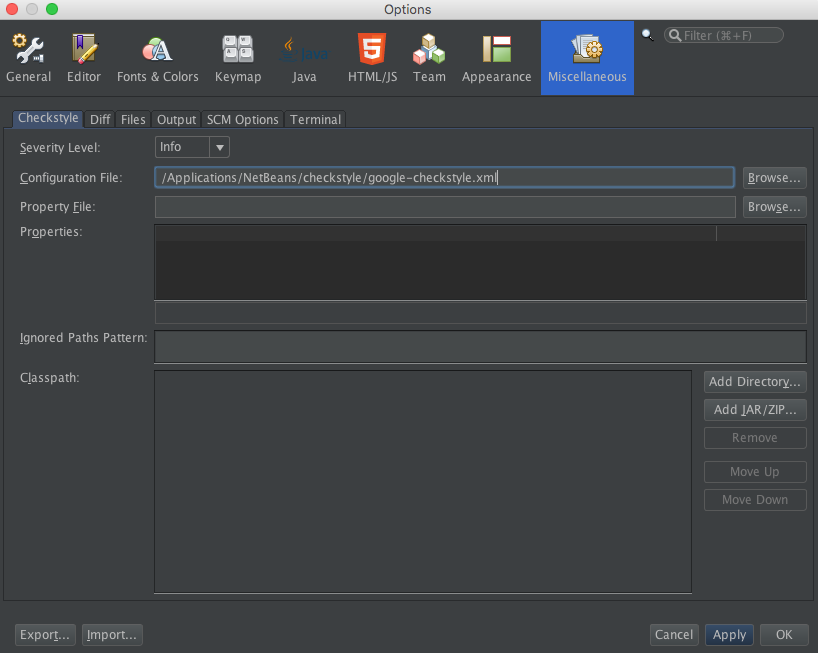

## Tema a tratar

La idea de esta guia en introducir lo que refiere al tema "Calidad de codigo", en esta oportunidad nos vamos a centrar en lo que tiene que ver con "Estandares de codificacion" y "Analizadores estaticos de codigo".

## Introduccion

### Estandares de codificacion
Como ya se sabe la mayoria del tiempo un equipo de desarollo de software realiza tareas de mantenimiento sobre una aplicacion, ya que se ha comprobado que el 80% del tiempo de vida de una aplicacion corresponde a mantenimiento.
Por lo cual es indispensable entender el codigo que iremos a mantener, el cual cabe destacar que dificilmente sea codificado por la misma persona que lo ira a mantener.

Como solucion a esto con el correr de los años distintas comunidades (Java, .Net, etc) han ido tomando decisiones con respecto a los estandares de codificacion, para contribuir al entendimiento del codigo.

```Java
public class Perro {
    private static int EDAD_MAXIMA = 15;
    private String nombre;
    private int E;
    
    ...
    ...
    ...
}
```

Si prestamos atencion al codigo anterior podemos darnos cuenta que la variable "EDAD_MAXIMA" refiere a una constante, la variable "nombre" seguramente un atributo de la clase, y la variable "E" no sabemos a que refiere y tambien podemos deducir que tiene un problema de nomeclatura.
Todo esto lo pudimos deducir ya que sabemos que las constantes se nombran en [snake case](https://en.wikipedia.org/wiki/Snake_case), y que toda variable se nombra en [lower camel case](https://en.wikipedia.org/wiki/Camel_case).

Todas estas convenciones junto a algunas otras han sido documentadas por distintas comunidades, por ejemplo la comunidad de Java y Google tienen sus propias convenciones.
 - [**Java Code Conventions**](http://www.oracle.com/technetwork/java/codeconventions-150003.pdf)
 - [**Google Code Conventions**](http://google.github.io/styleguide/javaguide.html)
 
### Analizadores estaticos de codigo
 
El análisis estático de codigo es un tipo de análisis que se realiza sin ejecutar el programa (el análisis realizado sobre los programas en ejecución se conoce como análisis dinámico de software). El término se aplica generalmente a los análisis realizados por una herramienta automática, el análisis realizado por un humano es llamado comprensión de programas (o entendimiento de programas) como también revisión de código.

Estas herramientas nos ayudan a detectar incumplimiento de estandares de codificacion, obtener metricas del software, detectar vulnerabilidades de seguridad o codigo vulnerable a fallas, etc.

Existen distintas herramientas, pero en este caso nos estaremos enfocando en dos basicamente; una de ellas nos permitira detectar problemas en la calidad de codigo y la otra detectar posibles bugs (errores) en nuestro codigo.

## Guia de trabajo

## CheckStyle

CheckStyle es una herramienta ([open source](https://github.com/checkstyle/checkstyle)) de calidad de código encargada de validar los estándares de codificacion. Es decir, chequea la sintaxis del código fuente que ha sido desarrollado, encontrando las ocurrencias de un determinado problema que haya sido previamente configurado mediante reglas para ser detectado.

La herramienta nos permite configurar cuales reglas aplicar; por lo tanto lo iremos a configurar para que respete el estandar de codificacion de [Google](http://google.github.io/styleguide/javaguide.html).
Esta herramienta se integra perfectamente como [plugin](https://www.sickboy.cz/checkstyle/download.html) de Netbeans, y nos permite visualizar los problemas encontrados dentro del mismo IDE.

### Proyecto sobre el cual iremos a trabajar

No es necesario crear un nuevo proyecto para poder probar la herramienta, en este repositorio se encuentra un proyecto llamado **CheckStyleEjemplo**. Por lo tanto, lo unico que deben hacer es clonar este repositorio.

Luego de clonado el repositorio, debemos abrir el proyecto:
1. Irnos a <kbd>File -> Open Proyect</kbd>.
2. Irnos al directorio donde tenemos clonado el proyecto.
3. Seleccionar el proyecto llamado **CheckStyleEjemplo** y clickear <kbd>Open Project</kbd>

Luego de esto ya deberiamos poder ver el proyecto en nuestro explorador de proyectos de Netbeans.

### Agregar plugin CheckStyle a Netbeans
 
Para instalar Checkstyle tenemos dos opciones descargar el plugin directamente como un archivo comprimido o realizar la instalacion online; en la [pagina oficial](https://www.sickboy.cz/checkstyle/download.html) debemos obtener la URL tanto para realizar la instalacion online o descargar el plugin directamente.

Para instalarlo online, se debe copiar la URL que aparece en la seccion "Online Installation" de la pagina oficial y agregarla como Update Center en la configuración de plugins en NetBeans; para realizar esto debemos:
1. Irnos a <kbd>Tools -> Plugins</kbd>.
2. Dirigirnos a la tab <kbd>Settings</kbd> y clickear en <kbd>Add</kbd>.
3. Escribir como nombre de provider "CheckStyle", y pegar la URL que copiamos anteriormente, para luego clickear en <kbd>OK</kbd>.

Deberia aparecernos en el listado de nuestros Update Centers el de CheckStyle:


Luego de comprobar que nos aparece como Update Center, debemos instalar el plugin para esto:
1. Irnos a la tab <kbd>Available Plugins</kbd>.
2. Buscar "CheckStyle", y checkear todos los resultados que nos aparecen.
3. Clickear sobre <kbd>Install</kbd>.

Luego debemos reiniciar Netbeans, y comprobar que efectivamente el plugin ha sido instalado para esto debernos irnos nuevamente a <kbd>Tools -> Plugins</kbd> y a la tab <kbd>Installed</kbd> y verlo de la sigueinte manera:


> **Aclaración:** La version de la captura de pantalla anterior puede ser distinta.

### Agregar archivo de configuracion a CheckStyle

Luego de instalar Checkstyle es hora de configurarlo, como dijimos anteriormente este nos permite definir reglas que son las que van a ser chequeadas.
Para esto lo que debemos hacer es lo siguiente:
1. Irnos a <kbd>Netbeans -> Preferences</kbd>.
2. Presionar sobre el tab <kbd>Miscellaneous</kbd> y luego sobre el tab <kbd>Checkstle</kbd>.
3. En el campo de texto "Configuration File" debemos ingresar la ruta donde se encuentra nuestro archivo XML que contiene las reglas (este archivo se encuentra en este repositorio bajo el nombre de **google_checkstyle.xml**).
4. Presionar sobre <kbd>Apply</kbd>.

La configuracion deberia quedar de la siguiente manera:


### Comprobar los nuevos warnings


 ## Autoría
**Autor:** Matías Crizul

**E-mail:** crizulm@gmail.com

### Referencias

1. https://es.wikipedia.org/wiki/Análisis_estático_de_software
2. https://github.com/arqsoftort/calidad
3. http://checkstyle.sourceforge.net/google_style.html
4. https://www.sickboy.cz/checkstyle/download.html
