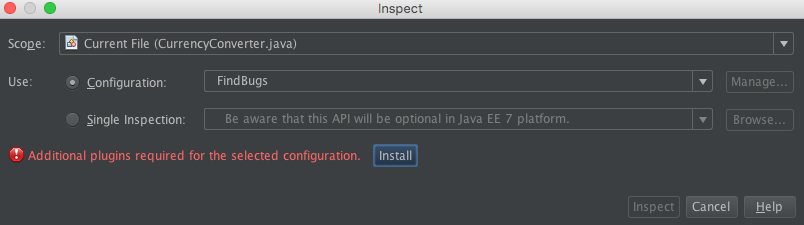

## Tema a tratar

La idea de esta guía en introducir lo que refiere al tema "Calidad de código", en esta oportunidad nos vamos a centrar en lo que tiene que ver con "Estándares de codificación" y "Analizadores estáticos de código".

## Introducción

### Estándares de codificación
Como ya se sabe la mayoría del tiempo un equipo de desarrollo de software realiza tareas de mantenimiento sobre una aplicación, ya que se ha comprobado que el 80% del tiempo de vida de una aplicación corresponde a mantenimiento.
Por lo cual es indispensable entender el código que iremos a mantener, el cual cabe destacar que difícilmente sea codificado por la misma persona que lo ira a mantener.

Como solución a esto con el correr de los años distintas comunidades (Java, .Net, etc) han ido tomando decisiones con respecto a los estándares de codificación, para contribuir al entendimiento del código.

```Java
public class Perro {
 private static int EDAD_MAXIMA = 15;
 private String nombre;
 private int E;
 
 ...
 ...
 ...
}
```

Si prestamos atención al código anterior podemos darnos cuenta que la variable "EDAD_MAXIMA" refiere a una constante, la variable "nombre" seguramente un atributo de la clase, y la variable "E" no sabemos a que refiere y también podemos deducir que tiene un problema de nomenclatura.
Todo esto lo pudimos deducir ya que sabemos que las constantes se nombran en [snake case](https://en.wikipedia.org/wiki/Snake_case), y que toda variable se nombra en [lower camel case](https://en.wikipedia.org/wiki/Camel_case).

Todas estas convenciones junto a algunas otras han sido documentadas por distintas comunidades, por ejemplo la comunidad de Java y Google tienen sus propias convenciones.
- [**Java Code Conventions**](http://www.oracle.com/technetwork/java/codeconventions-150003.pdf)
- [**Google Code Conventions**](http://google.github.io/styleguide/javaguide.html)

### Analizadores estáticos de código

El análisis estático de código es un tipo de análisis que se realiza sin ejecutar el programa (el análisis realizado sobre los programas en ejecución se conoce como análisis dinámico de software). El término se aplica generalmente a los análisis realizados por una herramienta automática, el análisis realizado por un humano es llamado comprensión de programas (o entendimiento de programas) como también revisión de código.

Estas herramientas nos ayudan a detectar incumplimiento de estándares de codificación, obtener métricas del software, detectar vulnerabilidades de seguridad o código vulnerable a fallas, etc.

Existen distintas herramientas, pero en este caso nos estaremos enfocando en dos básicamente; una de ellas nos permitirá detectar problemas en la calidad de código y la otra detectar posibles bugs (errores) en nuestro código.

## Guía de trabajo

## CheckStyle

CheckStyle es una herramienta ([open source](https://github.com/checkstyle/checkstyle)) de calidad de código encargada de validar los estándares de codificación. Es decir, chequea la sintaxis del código fuente que ha sido desarrollado, encontrando las ocurrencias de un determinado problema que haya sido previamente configurado mediante reglas para ser detectado.

La herramienta nos permite configurar cuales reglas aplicar; por lo tanto lo iremos a configurar para que respete el estándar de codificación de [Google](http://google.github.io/styleguide/javaguide.html).
Esta herramienta se integra perfectamente como [plugin](https://www.sickboy.cz/checkstyle/download.html) de Netbeans, y nos permite visualizar los problemas encontrados dentro del mismo IDE.

### Proyecto sobre el cual iremos a trabajar

No es necesario crear un nuevo proyecto para poder probar la herramienta, en este repositorio se encuentra un proyecto llamado **CheckStyleEjemplo**. Por lo tanto, lo único que deben hacer es clonar este repositorio.

Luego de clonado el repositorio, debemos abrir el proyecto:
1. Irnos a <kbd>File -> Open Proyect</kbd>.
2. Irnos al directorio donde tenemos clonado el proyecto.
3. Seleccionar el proyecto llamado **CheckStyleEjemplo** y clickear <kbd>Open Project</kbd>

Luego de esto ya deberíamos poder ver el proyecto en nuestro explorador de proyectos de Netbeans.

### Agregar plugin CheckStyle a Netbeans
 
Para instalar Checkstyle tenemos dos opciones descargar el plugin directamente como un archivo comprimido o realizar la instalación online; en la [pagina oficial](https://www.sickboy.cz/checkstyle/download.html) debemos obtener la URL tanto para realizar la instalación online o descargar el plugin directamente.

Para instalarlo online, se debe copiar la URL que aparece en la sección "Online Installation" de la pagina oficial y agregarla como Update Center en la configuración de plugins en NetBeans; para realizar esto debemos:
1. Irnos a <kbd>Tools -> Plugins</kbd>.
2. Dirigirnos a la tab <kbd>Settings</kbd> y clickear en <kbd>Add</kbd>.
3. Escribir como nombre de provider "CheckStyle", y pegar la URL que copiamos anteriormente, para luego clickear en <kbd>OK</kbd>.

Debería aparecernos en el listado de nuestros Update Centers el de CheckStyle:


Luego de comprobar que nos aparece como Update Center, debemos instalar el plugin para esto:
1. Irnos a la tab <kbd>Available Plugins</kbd>.
2. Buscar "CheckStyle", y checkear todos los resultados que nos aparecen.
3. Clickear sobre <kbd>Install</kbd>.

Luego debemos reiniciar Netbeans, y comprobar que efectivamente el plugin ha sido instalado para esto debernos irnos nuevamente a <kbd>Tools -> Plugins</kbd> y a la tab <kbd>Installed</kbd> y verlo de la siguiente manera:


> **Aclaración:** La versión de la captura de pantalla anterior puede ser distinta.

### Agregar archivo de configuración a CheckStyle

Luego de instalar Checkstyle es hora de configurarlo, como dijimos anteriormente este nos permite definir reglas que son las que van a ser chequeadas.
Para esto lo que debemos hacer es lo siguiente:
1. Irnos a <kbd>Netbeans -> Preferences</kbd>.
2. Presionar sobre el tab <kbd>Miscellaneous</kbd> y luego sobre el tab <kbd>Checkstle</kbd>.
3. En el campo de texto "Configuration File" debemos ingresar la ruta donde se encuentra nuestro archivo XML que contiene las reglas (este archivo se encuentra en este repositorio bajo el nombre de [**google-checkstyle.xml**](./google-checkstyle.xml)).
4. Presionar sobre <kbd>Apply</kbd>.

La configuración debería quedar de la siguiente manera:


### Comprobar los warnings en la clase CurrencyConverter

Luego de configurar el archivo de donde iremos a aplicar las reglas, debemos reiniciar Netbeans y ya deberíamos ver nuestro proyecto con ciertos WARNINGS marcados, estos warnings nos serán útil a la hora de que estemos programando y aparezcan poderlos solucionar de forma inmediata.


### Comprobar la ventana de Action Items

Checkstyle también tiene una ventana que se llama Action Items donde nos aparecen todos los problemas detectados, y nos permite filtrarlos a nivel de clase, o proyecto.
Si esta ventana no se encuentra abierta simplemente debe ir a <kbd> Window -> Action Items </kbd>.


### Corregir defectos

Para corregir el defecto simplemente debemos leer el warning que nos marca Checkstyle, la mayoría de las veces el warning es bastante claro, pero si no logramos comprenderlo siempre podemos recurrir a la [documentación oficial](http://google.github.io/styleguide/javaguide.html) de Google.

Por ejemplo el siguiente defecto nos dice que tenemos un bloque catch vacío en la línea 29 de la clase "CurrencyConverter".


## FindBugs

Findbugs es un analizador de código estático (open source) encargado encontrar posibles defectos (bugs) en nuestro código, los defectos encontrados por Findbugs se clasifican en distintas categorías por ejemplo:

| **Categoria** | **Ejemplo** |
|---------------------------|-------------------------------------------------------|
| Bad practice | Comparar String usando ==, o != |
| Dodgy code | Chequeo null redundante, de un valor que ya se sabia que era null |

Todas las categorías se encuentra descriptas en este [link](http://www.methodsandtools.com/tools/findbugs.php)

### Agregar plugin FindBugs a Netbeans

Para instalar el plugin simplemente debemos realizar lo siguiente:
1. Irnos a <kbd>Source -> Inspect</kbd>.
2. Seleccionar <kbd>FindsBugs</kbd> en la sección <kbd>Configuration</kbd>.
3. Nos saldrá un mensaje debajo que debemos instalar un plugin adicional, por lo cual clickeamos sobre <kbd>Install</kbd>.
4. Luego de finalizado el proceso el plugin ya se encuentra instalado.



### Inspeccionar el código utilizando FindBugs

Luego de instalado sobre la misma ventana de Inspección, debemos realizar lo siguiente:
1. Seleccionar el <kbd>Scope</kbd> de inspección, es decir el alcance; podemos hacerlo a nivel de clase, paquete, o proyecto.
2. Comprobar que este seleccionado <kbd>FindBugs</kbd> en la sección <kbd>Configuration</kbd>.
3. Realizar click sobre <kbd>Inspect</kbd>.

### Comprobar la ventana Inspector

Luego de realizado el análisis les debería desplegar la siguiente ventana:

En ella se listan todos los posibles defectos encontrados, y si nos dirigimos al ultimo icono del lado izquierdo podemos visualizar los defectos categorizados según el criterio mencionado al inicio de esta sección.

 ## Autoría
**Autor:** Matías Crizul

**E-mail:** crizulm@gmail.com

### Referencias 

1. https://es.wikipedia.org/wiki/Análisis_estático_de_software
2. https://github.com/arqsoftort/calidad
3. http://checkstyle.sourceforge.net/google_style.html
4. https://www.sickboy.cz/checkstyle/download.html
5. http://www.methodsandtools.com/tools/findbugs.php
